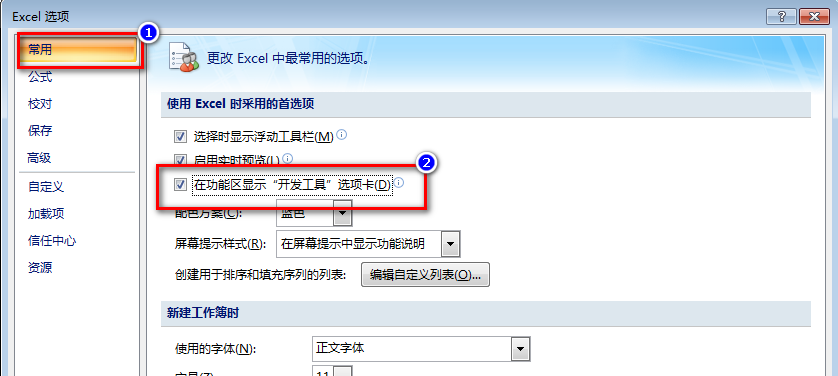
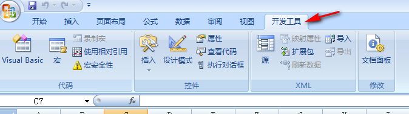

# 启用 Excel 开发工具教程

进行 Excel VBA 开发，需要使用「开发工具」选项卡包含的各项命令。默认情况下，「开发工具」选项卡是隐藏状态，需要手动启用。第一次启用后，在以后每次打开工作簿时，都会自动显示该选项卡。

## 启用开发工具

### Excel 2007

#### 第一步：打开Excel选项
* 在功能区任意一区域点击右键，弹出的菜单中选择「自定义快速访问工具栏」。
* 点击office图标 -> 点击「Excel选项」

#### 第二步：在左侧选择常用，在右侧选项卡列表中，找到「在功能区显示"开发工具"选项卡」并勾选。

#### 第三步：点击确定，这时在功能区可以看到「开发工具」了。

## 认识开发工具

开发工具选项卡共包含三组命令，其中代码组的命令是使用最频繁的一组命令。xml组和控件组的命令使用的较少，这部分在学习完基础知识后，详细介绍。

今天先简单说一下代码组命令的功能。

* Visual Basic：打开 VBA 编辑器，快捷键是 Alt + F11。
* 宏：打开宏列表，并且可以对列表中的宏进行编辑，例如运行、修改、删除等。这里的宏，就是我们在前一篇中说到的过程。
* 录制宏：将键盘和鼠标操作，自动转换成 VBA 代码。这个功能在实际的开发过程中非常有用。具体用法以后的文章中介绍。
* 使用相对引用：录制宏时的设置选项。
* 宏安全性：设置 Excel 如何对待包含 VBA 代码的工作簿。因为存在一些恶意的代码，所以一般将宏安全性设置为禁用。
