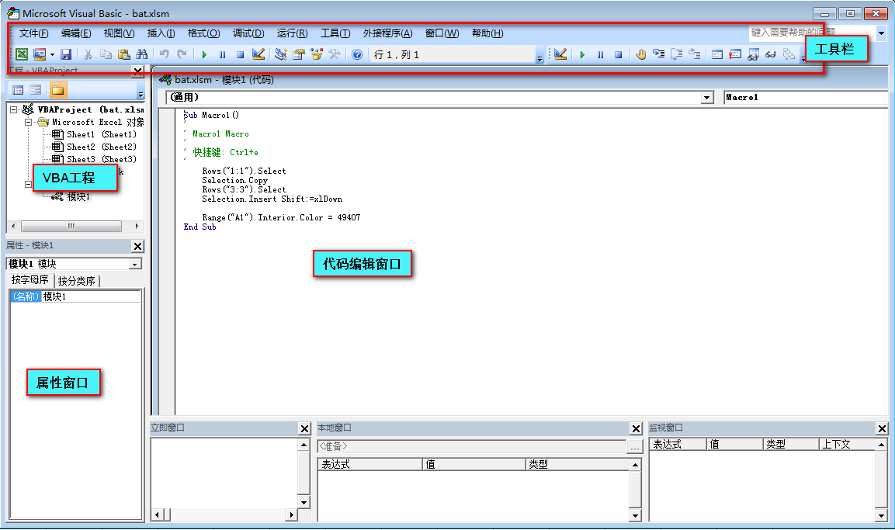

# 使用 VBA 编辑器进行 Excel VBA 开发

对于 Excel VBA 开发来说，VBA 编辑器就是最核心的开发工具。可以说，Excel VBA 开发中的每一个步骤，几乎都在 VBA 编辑器中进行，包括编写、调试、测试、运行、代码组织等。

## 打开 VBA 编辑器
**方法一，使用开发工具选项卡**。点击开发工具选项卡Visual Basic命令。-> [开启开发工具选项卡](./enableExcelDevTool.md)

**方法二，工作表右键菜单**。在任意工作表标签上方，右键，在弹出的选项列表中，选择「查看代码」。

**方法三，使用快捷键 Alt + F11**。

## 认识 VBA 编辑器

通过上述方法打开编辑器，将会看到如下界面。图中已标出编辑器每个模块的名称。



编辑器中每个模块的基本用法如下：

* **工具栏**：编辑器命令栏，与 Excel 功能区域类似，包含 Excel VBA 开发相关的命令。
* **VBA 工程**：显示当前 VBA 工程包含的所有对象。通常，一个工作簿就是一个 VBA 工程，其中包括 Excel 对象、工作表对象、模块等。
* **属性窗口**：查看和设置选中对象的属性的窗口。
* **代码编辑窗口**：实际编写代码的位置。编写、修改、保存代码，都在这里进行。
* **立即窗口**：代码运行过程中，打印出的内容，在立即窗口中显示。一般用于调试代码。
* **本地窗口**：代码运行过程中，本地变量值在本地窗口中显示。一般用于调试代码。
* **监视窗口**：代码运行过程中，监视窗口中可以添加变量、表达式等等监视结果。一般用于调试代码。

## 管理 VBA 工程

通常，一个工作簿就是一个 VBA 工程，其中包括 Excel 对象、工作表对象、模块等。当多个工作簿同时打开时，他们公用同一个 VBA 编辑器，VBA 工程界面显示所有的 VBA 工程。

### 插入/删除模块

* 在一个 VBA 工程中想要插入新的模块时，可在 VBA 工程右键，选择插入类型（用户窗体、模块、类模块）即可。
* 要删除模块，选中模块，右键，选择「移除 模块」

### 修改对象/模块属性

当点击 VBA 工程界面中任意一个 Excel 对象或模块时，在下方的属性窗口显示选中对象的各项属性信息。其中左侧是属性名，右侧是属性值，在这里可以直接手动修改属性值。

## 运行 VBA 代码

编辑器中运行 VBA 代码，可能是执行最频繁的操作了。在开发过程中，每更新一次代码，可能需要运行，看一下其结果是否正确。

现在在模块1中有以下一段代码（如何写 VBA 代码，将在下一篇中介绍）：

```vba
Sub MyCode()

    Sheet1.Range("A1") = "Hello World"

End Sub
```

代码的作用是，在 Sheet1 工作表 A1 单元格，写入 “Hello World” 内容。

在编辑器中运行 VBA 代码，有以下 3 种方法：

1. **使用工具栏命令**

首选，将光标放置在要运行的代码的任意一处，再在工具栏选择「运行」→「运行子过程/用户窗体」命令。

2. **使用快捷工具栏命令**
首选，将光标放置在要运行的代码的任意一处，再点击快捷工具栏「▶ 」按钮。

3. **使用快捷键 F5**
首选，将光标放置在要运行的代码的任意一处，再使用快捷键 F5，即可运行代码。
