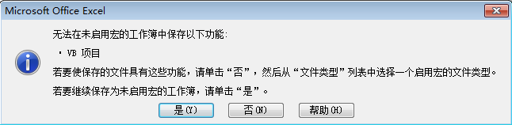
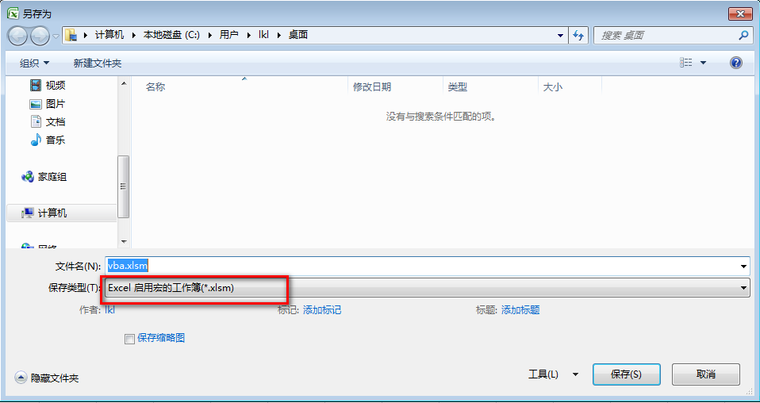

# Excel 保存包含 VBA 代码的工作簿

2003 及之前的版本中，在 xls类型工作簿可以任意编写并保存 VBA 代码。

2007 版本开始，第一次保存包含 VBA 代码的工作簿时，Excel 会提示“无法保存工作簿”。

这是因为，含 VBA 代码的工作簿，必须保存成启用宏的工作簿类型。Excel 为此提供了xlsm类型的工作簿，称之为「**启用宏的工作簿**」。

## 保存启用宏的工作簿

第一次保存时，将弹出前述提示框，为了保存 VBA 代码，其中选择「否」。在另存为窗口，保存类型列表中，选择「**Excel 启用宏的工作簿(*.xlsm)**」。

选择后保存，可以看到工作簿类型，xlsm。