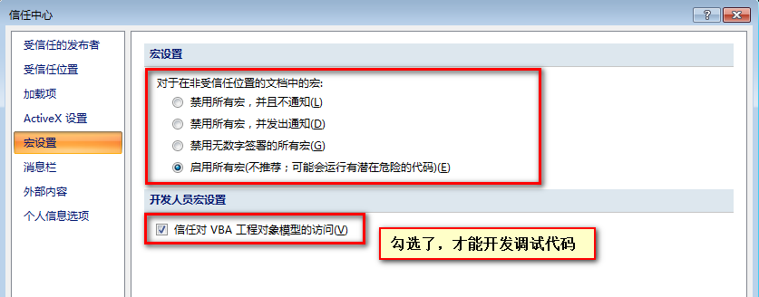
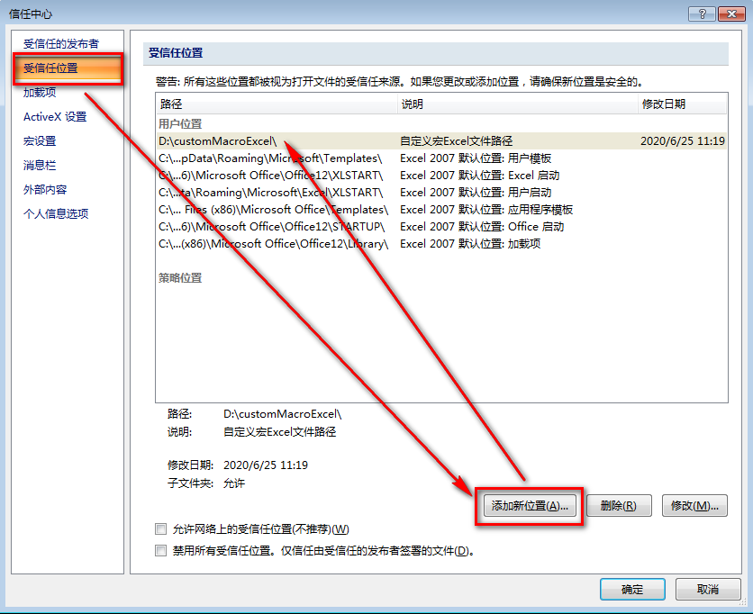

# Excel VBA 设置宏安全性

**如果贸然运行来源不明的工作簿内的 VBA 代码，有可能导致电脑中毒**。默认情况下，为防止来源不明的工作簿自带宏自动运行，Excel 会禁用宏的运行。

但是我们希望可以运行我们自己写的 VBA 代码，或者我们认为安全的其他 VBA 代码。Excel 为此提供了多种安全选项，可以做到有效防止代码自动运行，又能正确运行我们自己的代码。

## 宏安全性
Excel 提供 4 种宏安全性选项，在开发工具选项卡，点击「宏安全性」按钮，打开信任中心。4 种选项具体如下。

* 禁用所有宏，并且不通知：无法运行打开的工作簿内的 VBA 代码，Excel 也不会提示工作簿包含代码。
* 禁用所有宏，并发出通知：默认状态下，无法运行 VBA 代码。但是 Excel 在打开包含 VBA 代码的工作簿时，在编辑栏上方，显示安全警告，并且可以选择启用代码运行或不启用。如果选择启用，下次打开相同的工作簿，不会出现警告。
* 禁用无数字签署的所有宏：宏将被禁用，但如果存在宏，则会显示安全警告。但是，如果受信任发布者对宏进行了数字签名，并且您已经信任该发布者，则可运行该宏。如果您尚未信任该发布者，则会通知您启用签署的宏并信任该发布者。
* 启用所有宏(不推荐；可能会运行有潜在危险的代码)：可以运行所有宏。一般不推荐选择此选项。

## 宏安全性建议策略
在实际 Excel VBA 开发过程中，我们即希望禁止来源不明的代码，又希望我们自己的代码不提示安全警告。建议采取如下的安全性策略：

1. 禁用所有宏，并发出通知。
2. 在电脑上创建一个用于存放信任的包含代码的工作簿的文件夹，将此工作簿添加到「受信任位置」。

### 禁用所有宏，并发出通知
在开发工具选项卡，点击「宏安全性」按钮，在宏设置里选择「禁用所有宏，并发出通知」。

### 添加受信任位置

把一个文件夹添加到 Excel 受信任的位置后，该文件夹下的包含 VBA 代码的工作簿打开时，不会提示安全警告，也无需每次手动开启代码。

**设置方法**：在开发工具选项卡，点击「宏安全性」按钮，弹出信任中心窗口，在左侧列表中，选择「受信任位置」。点击下方的「添加新位置」按钮，添加自己信任的一个文件夹。

