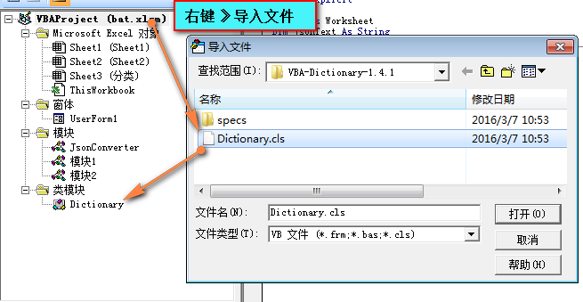
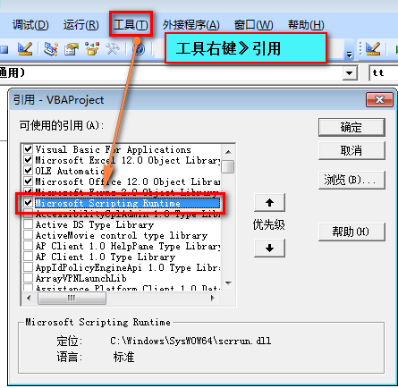

# VBA Json 数据处理教程

* [导入外部模块](#导入外部模块)
  * [VBA-Dictionary](#VBADictionary)
  * [VBA-JSON](#VBAJSON)
* [Setup JSON to Excel](#SetupJSONtoExcel)
* [对象转Json数据](#对象转Json数据)

## 导入外部模块

VBA 本身是不支持Json数据结构的解析的，需要导入第三方模块。

### <a name="VBADictionary">VBA-Dictionary</a>

[VBA-Dictionary](https://github.com/VBA-tools/VBA-Dictionary)是有用且功能强大的Scripting.Dictionary的直接替代，因此它可以在Mac和Windows上使用。 它被设计为Scripting.Dictionary的精确替代，包括Item作为默认属性（Dict（“ A”）= Dict.Item（“ A”）），匹配的错误代码以及匹配的方法和属性。

Download the [latest release](https://github.com/VBA-tools/VBA-Dictionary/releases), unzip, and import Dictionary.cls into your VBA project.



### <a name="VBAJSON">[VBA-JSON](https://github.com/VBA-tools/VBA-JSON)</a>

VBA（Windows和Mac Excel，Access和其他Office应用程序）的JSON转换和解析。 它源于出色的vba-json项目，并进行了补充和改进以解决错误和提高性能（作为VBA-Web的一部分）。

**Installation**

1. Download the [latest release](https://github.com/VBA-tools/VBA-JSON/releases)
2. Import JsonConverter.bas into your project (Open VBA Editor, Alt + F11; File > Import File)
3. Add Dictionary reference/class
    * For Windows-only, include a reference to "Microsoft Scripting Runtime"
    * For Windows and Mac, include VBA-Dictionary



## <a name="SetupJSONtoExcel">Setup JSON to Excel</a>

### 准备Json数据源

```json
[{"color":"red","value":"#f00"},{"color":"green","value":"#0f0"},{"color":"blue","value":"#00f"},{"color":"cyan","value":"#0ff"},{"color":"magenta","value":"#f0f"},{"color":"yellow","value":"#ff0"},{"color":"black","value":"#000"}]
```

### Parse Json

```vba
Public Sub ParseJson()

    Dim ws As Worksheet
    Dim jsonText As String
    Dim jsonObject As Object
    
    Set ws = Worksheets("JSON to Excel Example")
    
    jsonText = ws.Cells(1, 1)
    '解析Json数据
    Set jsonObject = JsonConverter.ParseJson(jsonText)

End Sub
```

### Import JSON to Excel

将JSON导入Excel的代码听起来令人生畏，但比听起来容易得多。 在高层次上，您要做的就是遍历创建的jsonObject，然后将每个字典值写入工作表。

```vba
Public Sub JsonToExcelExample()

    Dim jsonText As String
    Dim jsonObject As Object, item As Object
    Dim i As Long
    Dim ws As Worksheet
    
    Set ws = Worksheets("JSON to Excel Example")
    
    jsonText = ws.Cells(1, 1)
    '解析Json数据
    Set jsonObject = JsonConverter.ParseJson(jsonText)
    
    i = 3

    ws.Cells(2, 1) = "Color"
    ws.Cells(2, 2) = "Hex Code"

    For Each item In jsonObject
        ws.Cells(i, 1) = item("color")
        ws.Cells(i, 2) = item("value")
        i = i + 1
    Next

End Sub
```
我设置了一个计数器变量`i`，可以用来告诉循环将数据写入哪一行。 接下来，为数据创建我的列标题。 然后，对于`jsonObject`中的每个“`item`”，将字典值写入我指示的单元格行并递增我的计数器变量。我们将JSON导入Excel代码的结果如下所示：

||A|B|C
|---|---|---|---
|1|\[{"color":"red","value":"#f00"},<br>{"color":"green","value":"#0f0"},<br>{"color":"blue","value":"#00f"},<br>{"color":"cyan","value":"#0ff"},<br>{"color":"magenta","value":"#f0f"},<br>{"color":"yellow","value":"#ff0"},<br>{"color":"black","value":"#000"}]	| | |
|2|Color	|Hex Code
|3|red	|#f00
|4|green	|#0f0
|5|blue	|#00f
|6|cyan	|#0ff
|7|magenta	|#f0f
|8|yellow	|#ff0
|9|black	|#000

### 从json文件读取数据到Excel

```vba
Sub JsonFileParse()
    ' Advanced example: Read .json file and load into sheet (Windows-only)
    ' (add reference to Microsoft Scripting Runtime)
    ' {"values":[{"a":1,"b":2,"c":3},{"a":11,"b":12,"c":13}]}
    
    Dim FSO As New FileSystemObject
    Dim JsonTS As TextStream
    Dim JsonText As String
    Dim Parsed As Object
    
    ' Read .json file
    Set JsonTS = FSO.OpenTextFile("D:\customMacroExcel\example.json", ForReading)
    JsonText = JsonTS.ReadAll
    Debug.Print JsonText
    JsonTS.Close
    
    ' Parse json to Dictionary
    ' "values" is parsed as Collection
    ' each item in "values" is parsed as Dictionary
    Set Parsed = JsonConverter.ParseJson(JsonText)
    
    ' Prepare and write values to sheet
    Dim Values As Variant
    ReDim Values(Parsed("values").Count, 3)
    
    Dim Value As Object
    Dim i As Long
    
    i = 0
    For Each Value In Parsed("values")
      Values(i, 0) = Value("a")
      Values(i, 1) = Value("b")
      Values(i, 2) = Value("c")
      i = i + 1
    Next Value
    
    Sheets("example").Range(Cells(1, 1), Cells(Parsed("values").Count, 3)) = Values
End Sub
```
输出结果：

| |A|B|C
|---|---|---|---
|1|1	|2	|3
|2|11	|12	|13

## <a name="对象转Json数据">对象转Json数据</a>

```vba
Sub ObjectToJsonExample()

    Dim Json As Object
    Set Json = JsonConverter.ParseJson("{""a"":123,""b"":[1,2,3,4],""c"":{""d"":456}}")
    
    ' Json("a") -> 123
    ' Json("b")(2) -> 2
    ' Json("c")("d") -> 456
    Json("c")("e") = 789
    
    '对象转Json
    Debug.Print JsonConverter.ConvertToJson(Json)
    ' -> {"a":123,"b":[1,2,3,4],"c":{"d":456,"e":789}}
    
    '对象转格式化Json
    Debug.Print JsonConverter.ConvertToJson(Json, Whitespace:=2)
    '{
    '  "a": 123,
    '  "b": [
    '    1,
    '    2,
    '    3,
    '    4
    '  ],
    '  "c": {
    '    "d": 456,
    '    "e": 789
    '  }
    '}

End Sub
```
