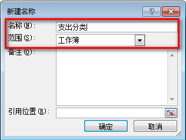
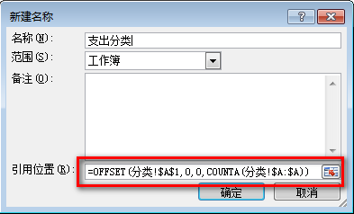
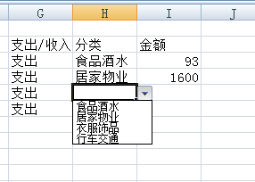
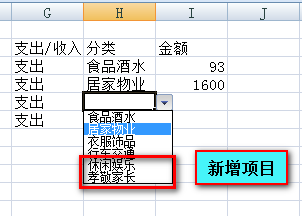

# Excel 定义动态名称教程

Excel 中名称表示一固定区域，通过定义的名称获取该区域的数据。相对与 Excel 的`引用方式`，在`公式`、`数据验证`等需要引用的地方，使用名称更加易懂并快捷。

> 使用常规方法定义名称，其表示的区域一般是固定区域，无法动态地调整区域的大小。

* [第一步，准备名称源数据列](#准备名称源数据列)
* [第二步，定义名称](#定义名称)
* [第三步，输入动态引用公式](#输入动态引用公式)
* [使用动态名称](#使用动态名称)

本篇以记账模板中，支出分类动态添加新的项目为例说明。

## <a name="准备名称源数据列">第一步，准备名称源数据列</a>

第一步很简单，在工作表某一列准备名称需要引用的源数据。建议最好从第一行开始，便于管理。

||A|B
|---|---|---
|1|食品酒水|
|2|居家物业|
|3|衣服饰品|
|4|行车交通|
|5||
|6||
|7||

## <a name="定义名称">第二步，定义名称</a>

在功能区域切换到【公式】选项卡，点击【定义名称】命令，弹出以下定义名称菜单。其中输入名称，范围选择工作簿。



## <a name="输入动态引用公式">第三步，输入动态引用公式</a>

定义名称需要提供源数据所在区域的引用。为了动态调整源数据的引用，以公式的方式输入引用位置。

动态引用的通用公式如下：
```vba
=OFFSET(源数据第一行单元格, 0, 0, COUNTA(源数据所在列))
```
本例中，支出分类位于「分类」在工作表的「A」列，动态引用公式如下：
```vba
=OFFSET(分类!$A$1,0,0,COUNTA(分类!$A:$A))
```



输入完成后点击确定，完成定义名称。

## 使用动态名称

在记账模板分类列，设置[下拉菜单](./makeDropDownMenuTutorial.md)，源数据引用上一步定义的【支出分类】名称。



现在支出分类源数据列新增更多项目。

||A|B
|---|---|---
|1|食品酒水|
|2|居家物业|
|3|衣服饰品|
|4|行车交通|
|5|休闲娱乐|
|6|孝敬家长|
|7||

名称的引用范围会自动扩展到最后一个项目，下拉菜单也会自动增加相应的支出项目。

