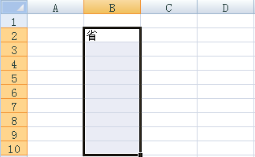
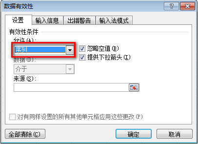
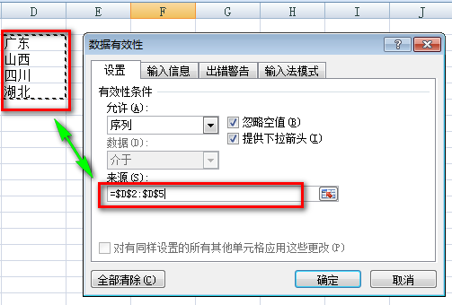
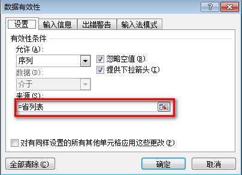
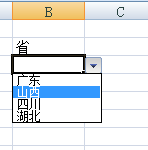
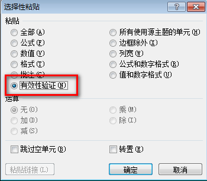

# Excel 制作一级下拉菜单教程

下拉菜单使得输入相同数据更方便。Excel 制作一级下拉菜单简单直接。

* [第一步，选择应用下拉菜单的单元格](#选择应用下拉菜单的单元格)
* [第二步，打开数据验证对话框](#打开数据验证对话框)
* [第三步，选择「序列」验证条件](#选择序列验证条件)
* [第四步，输入下拉菜单选项源](#输入下拉菜单选项源)
  * [直接选择引用](#直接选择引用)
  * [使用名称](#使用名称)
* [第五步，下拉菜单制作完成](#下拉菜单制作完成)
* [下拉菜单应用到更多单元格](#下拉菜单应用到更多单元格)

## <a name="选择应用下拉菜单的单元格">第一步，选择应用下拉菜单的单元格</a>

第一步很简单，只需把需要应用下拉菜单的单元格全部选中即可。




## <a name="打开数据验证对话框">第二步，打开数据验证对话框</a>

在功能区切换到【数据】选项卡，其中选择 [数据验证] 命令，打开数据验证对话框。


## <a name="选择序列验证条件">第三步，选择「序列」验证条件</a>

在数据验证对话框中，验证条件允许列表中，选择【序列】选项。



## <a name="输入下拉菜单选项源">第四步，输入下拉菜单选项源</a>

允许列表中选择序列后，下方会出现【来源】输入框。输入选项源有两种方法，**直接选择引用**和**使用名称**。

### 直接选择引用
点击输入框后，在工作表，用鼠标选择菜单的选项。



### [使用名称](./defineDynamicNameTutorial.md)

或者输入包含选项列表的名称，通用公式如下：
```
=名称
```


## <a name="下拉菜单制作完成">第五步，下拉菜单制作完成</a>

来源输入完成后，点击确定，完成菜单制作。选择单元格时，右侧会出现向下箭头，点击该箭头即可打开菜单列表。



## 下拉菜单应用到更多单元格

有时下拉菜单制作完成后，需要应用到更多的单元格，这时候需要用到 Excel 的选择性粘贴功能。具体步骤如下：

1. 选中包含下拉菜单的单元格；
2. 复制该单元格；
3. 选择应用下拉菜单的所有单元格；
4. 选择性粘贴；
5. 在选择性粘贴选项中，选择【有效性验证】选项，点击确定，完成应用。



