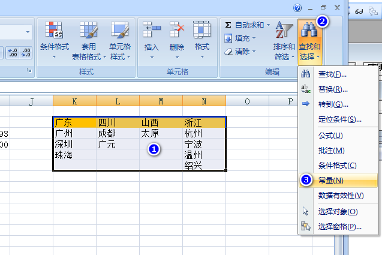
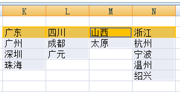
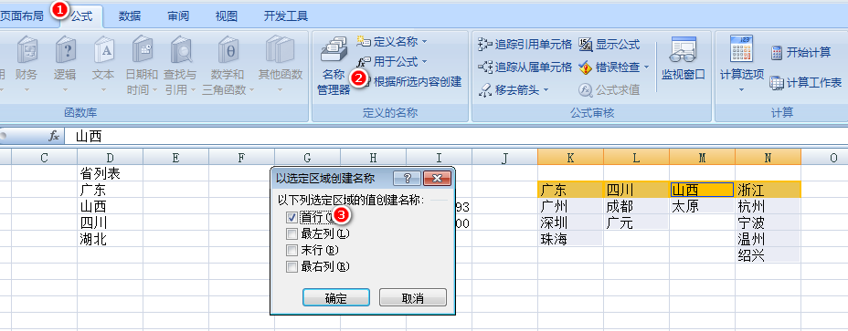
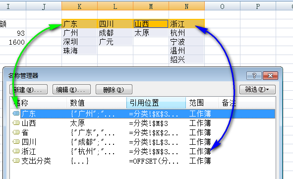
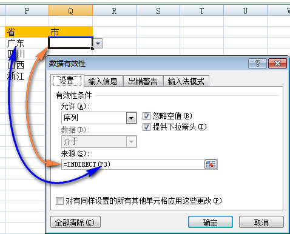

# Excel 制作二级联动下拉菜单教程

二级联动下拉菜单可以根据一级菜单的内容，动态调整二级菜单的内容，显著提高输入有依赖关系的数据的效率。

本篇文章介绍 Excel 制作二级联动下拉菜单的方法，将用到 `INDIRECT 函数`和 **Excel 名称**。


* [第一步，准备一二级下拉菜单的源数据](#准备一二级下拉菜单的源数据)
* [第二步，制作一级下拉菜单](#制作一级下拉菜单)
* [第三步，精确选择二级菜单数据](#精确选择二级菜单数据)
* [第四步，根据所选内容创建名称](#根据所选内容创建名称)
* [第五步，动态引用二级下拉菜单内容](#动态引用二级下拉菜单内容)
* [第六步，完成制作](#完成制作)

## <a name="准备一二级下拉菜单的源数据">第一步，准备一二级下拉菜单的源数据</a>

为制作二级联动下拉菜单，准备如下格式的源数据表格。数据区域首行是一级菜单的来源，每一列数据是对应的二级菜单的来源。

||K|L|M|N
|---|---|---|---|---
|1||||
|2|广东	|四川	|山西	|浙江
|3|广州	|成都	|太原	|杭州
|4|深圳	|广元	|	|宁波
|5|珠海|		|	|温州
|6||||			绍兴


## <a name="制作一级下拉菜单">第二步，制作一级下拉菜单</a>

根据源数据的第一行，[制作一级下拉菜单](./makeDropDownMenuTutorial.md)。

## <a name="精确选择二级菜单数据">第三步，精确选择二级菜单数据</a>

这一步一次性精确选择每一个二级菜单的数据来源，剔除因数据长度不同而会出现的空单元格。

精确选择步骤如下：

1. 选中包括首行在内的一二级菜单的全部数据；
2. 点击【开始】选项卡，【查找与选择】列表中的【常量】命令；



3. Excel 会自动选择有内容的单元格，剔除空单元格。



## <a name="根据所选内容创建名称">第四步，根据所选内容创建名称</a>

接上一步，精确选中数据源后，转到功能区【公式】选项卡，点击【根据所选内容创建】，在弹出的对话框中，只选择「首行」，再确定，Excel 会一次性批量创建名称。



其中，每一个名称的标题是数据区域首行单元格，即一级菜单的源数据。这为下一步动态选择二级菜单内容提供基础。



## <a name="动态引用二级下拉菜单内容">第五步，动态引用二级下拉菜单内容</a>

这一步与制作一级菜单的步骤基本相同，唯一不同点是数据源的选择。

由于是根据一级菜单的内容动态调整二级菜单列表，需要使用 `INDIRECT 函数`指向对应的上一步创建的名称。

数据源的通用公式如下：
```vba
=INDIRECT(一级菜单单元格引用)
```



> 注意，一级菜单对应的单元格需要以相对引用方式书写，即不写美元符号（$）。

## <a name="完成制作">第六步，完成制作</a>

经过前述步骤，一二级联动菜单制作完成。二级下拉菜单的内容根据一级菜单选择的内容动态调整。

